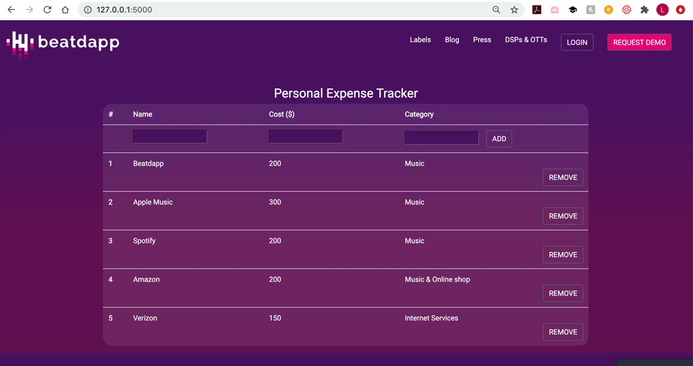

# Expense Tracker
## Getting Started

Run this to install packages
```
pip install -r requirements.txt
```

## Run
Have python3 installed
Use the following to start the tracker app.
```
On Mac: 
python3 app.py
```
```
On Windows:
python app.py
```

## Outlook():
